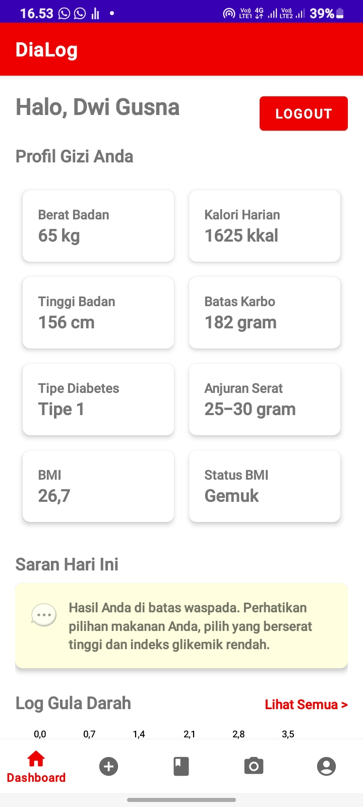
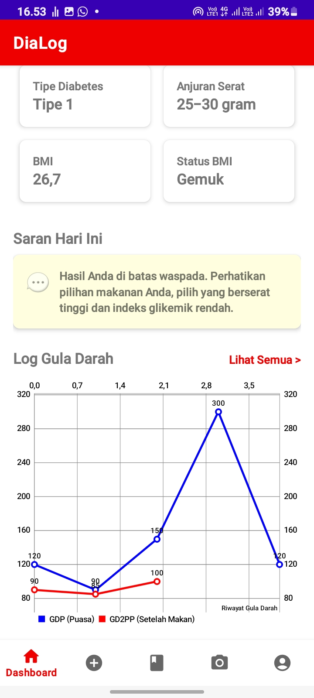
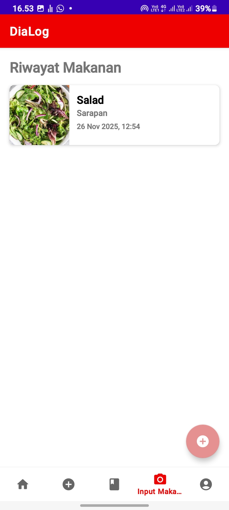
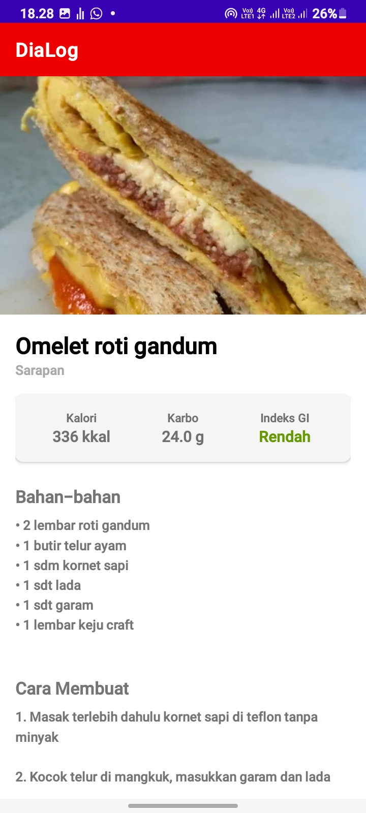

# 🩸 DiaLog - Diabetes Management Assistant

<p align="center">
  
  <br>
  <i>"Sehat Terkontrol, Hidup Lebih Berkualitas."</i>
</p>

---

## 📖 About The Project

**DiaLog** is a native Android application designed to assist diabetic patients in managing their daily health routines. It addresses common issues such as manual tracking difficulties, lack of nutritional awareness, and the need for personalized diet recommendations.

Unlike traditional logging apps, DiaLog offers **Smart Advice**—providing instant, actionable feedback based on the user's latest blood glucose readings and calculating daily calorie/carb limits based on their physical profile.

---

## ✨ Key Features

### 1. 📊 Smart Dashboard & Profile
* **Auto-BMI Calculation:** Real-time Body Mass Index calculation with status (Underweight/Normal/Obese).
* **Nutritional Needs:** Calculates daily calorie and carbohydrate limits based on gender, weight, and height.
* **Smart Advice:** Proactive feedback system that gives warnings or praise based on recent blood sugar trends.

### 2. 🩸 Blood Sugar Monitoring
* **Flexible Logging:** Support for Fasting (GDP) and Post-Prandial (GD2PP) logging.
* **Auto-Diagnosis:** Automatically labels readings as "Normal", "Pre-diabetes", or "Diabetes" based on medical standards.
* **Visual Analytics:** Interactive **Line Chart** to visualize health trends over time.

### 3. 🍽️ Food Journal (Food Log)
* **Visual Proof:** Mandatory photo input (via Camera or Gallery) for every meal entry.
* **Efficient Storage:** Utilizes **Base64 encoding** to store images directly in Firestore, eliminating the need for complex external storage buckets.
* **History Tracking:** Detailed log of daily meals with portion sizes.

### 4. 🥗 Meal Planner & Recipes
* **Categorized Menu:** Structured recommendations for Breakfast, Lunch, Dinner, and Snacks.
* **Healthy Recipes:** Curated list of diabetic-friendly recipes complete with:
    * Calorie & Glycemic Index (GI) info.
    * Ingredient lists.
    * Step-by-step cooking instructions.

---

## 🛠️ Tech Stack

This project is built using **Android Native** technologies to ensure high performance and hardware access.

* **Language:** [Kotlin](https://kotlinlang.org/)
* **UI Toolkit:** XML Layouts with Material Design Components
* **Architecture Pattern:** MVC / MVVM (via ViewBinding)
* **Backend (Serverless):**
    * **Firebase Authentication:** Email/Password Login & Registration.
    * **Google Cloud Firestore:** Real-time NoSQL database for storing user data, logs, and recipes.
* **Key Libraries:**
    * **[MPAndroidChart](https://github.com/PhilJay/MPAndroidChart):** For visualizing blood sugar graphs.
    * **[Glide](https://github.com/bumptech/glide):** For efficient image loading and caching.
    * **ViewBinding:** For type-safe UI interaction.

---

## 📸 Screenshots

| Dashboard | Blood Sugar Log | Food History | Recipe Detail |
|:---:|:---:|:---:|:---:|
|  |  |  |  |


---

## 🚀 Getting Started

To run this project locally, follow these steps:

### Prerequisites
* Android Studio (latest version recommended).
* Android SDK (min SDK 24).

### Installation

1.  **Clone the repository**
    ```sh
    git clone https://github.com/dwiiittt/DiaLog.git
    ```
2.  **Open in Android Studio**
    * Open Android Studio -> File -> Open -> Select the cloned folder.
    * Let Gradle sync the project.

3.  **Firebase Configuration (Important)**
    * This project uses Firebase. You must provide your own `google-services.json`.
    * Create a project in [Firebase Console](https://console.firebase.google.com/).
    * Add an Android App (package name: `com.example.myapplication`).
    * Download `google-services.json` and place it in the `app/` directory.
    * Enable **Authentication** (Email/Password) and **Firestore Database** in your Firebase Console.

4.  **Run the App**
    * Connect your Android device or use an Emulator.
    * Click the "Run" button (Shift+F10).

---

## ⚠️ Important Note on Image Storage

This app uses a unique approach for image storage. Instead of using Firebase Storage (buckets), images taken by the user are compressed and converted into **Base64 Strings**. These strings are stored directly within the Firestore documents. This approach was chosen to:
* Simplify the architecture.
* Reduce dependency on external storage rules.
* Allow offline-first capabilities (future development).

---

## 👥 Authors / Developers
* **Alya Putri Avianti**
* **Dwi Gusna**
* **Nurul Hidayah**

---

## 📄 License

This project is licensed under the MIT License - see the [LICENSE](LICENSE) file for details.
